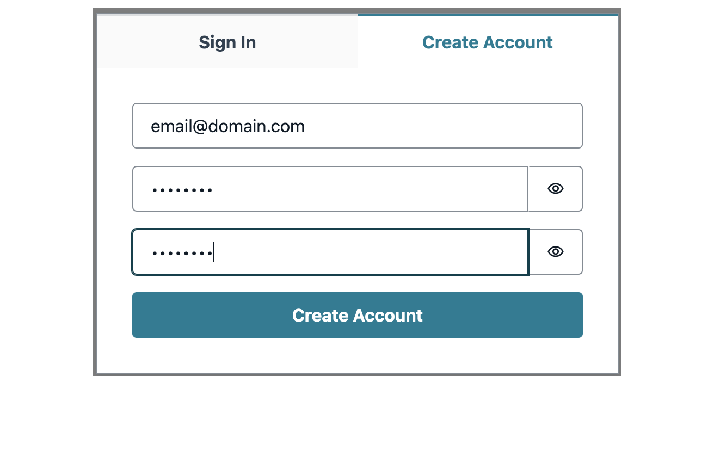

# Insurance Claims Processing using Serverless and Event-Driven Architecture

## Introduction

This code repository contains sample application for Insurance Claims Processing using Serverless and Event Driven Architecture as described in [this blog](https://aws.amazon.com/blogs/industries/building-a-modern-event-driven-application-for-insurance-claims-processing-part-2/).

## Structure

This sample application comprises:

- Frontend - using AWS AppSync and ReactJS
- Backend - using AWS Serverless Cloud Native services with AWS CDK as IaC

The backend infrastructure is set up at the root folder of the repository. Code for frontend is under `/react-claims` directory.

## Microservices Architecture


Different services in backend architecture interact with Amazon EventBridge Event Bus. The event rules can invoke more than one target for any event. For example, when customer is submitted successfully, notification service is invoked to notify front end and a step function is invoked to process the customer and create urls to upload license and vehicle images.

## Setup

### Prerequisites

- Install [NodeJS](https://nodejs.org/en/download/)
- [Set up AWS CDK](https://docs.aws.amazon.com/cdk/latest/guide/getting_started.html)
- [Set up AWS CLI](https://docs.aws.amazon.com/cli/latest/userguide/getting-started-install.html)
- [Configure AWS CLI](https://docs.aws.amazon.com/cli/latest/userguide/cli-configure-quickstart.html)
- [Install Amplify CLI](https://docs.amplify.aws/cli/start/install/)
- Download and install [Docker Desktop](https://www.docker.com/products/docker-desktop/)

### Fake Image Recognition APIs

> :warning: DO NOT MISS THIS SETUP BEFORE DEPLOYING THE STACK

Ideally, when this application runs in production it depends on inference endpoints to detect car color and car damages. This can be achieved by using Amazon Rekognition Custom Label. You can send a JPEG/PNG image to the endpoint (using API Gateway) and Rekognition Custom Label. The APIs in this sample expects a response as below:

- Car color prediction API response:

```json
{
  "Predictions": [
    {
      "Name": "red",
      "Confidence": 97.56799774169922
    }
  ]
}
```

- Car damage prediction API response:

```json
{
  "Predictions": [
    {
      "Name": "bumper_dent",
      "Confidence": 99.53099822998047
    }
  ]
}
```

However, for that to happen, one should train Rekognition, use custom labels, and create an API endpoint which makes calls to Rekognition, after which you can use the inference endpoint with a higher confidence score. This setup will incur some cost. So, for simplicity, this sample application fakes the color detection and damage detection API responses.

You can use [Webhook](https://webhook.site/) or any other API faker of your choice to create fake APIs. Shown below is an example where you can replace your webhook URL respective to each use case (color or damage). Here is the how `/lib/config.ts` should look like:

```javascript
// lib/config.ts
const config = {
  // Green Color Car
  // Return: { "Predictions": [{ "Name": "green", "Confidence": 95.76799774169922 }] }
  COLOR_DETECT_API:
    "https://webhook.site/0055038f-a393-4f81-b149-4376ebe4bf93/",

  // Red Color Car
  // Return: { "Predictions": [{ "Name": "red", "Confidence": 97.56799774169922 }] }
  // COLOR_DETECT_API: "https://webhook.site/fb720eb9-e701-4376-9ffc-3f30f7691632/",

  // No Damage
  // Return: { "Predictions": [{ "Name": "unknown", "Confidence": 99.98300170898438 }] }
  DAMAGE_DETECT_API:
    "https://webhook.site/b02ce4de-739a-4cb8-bae1-c904b4516aa5/",

  // Bumper Dent
  // Return: { "Predictions": [{ "Name": "bumper_dent", "Confidence": 84.26200103759766 }] }
  // DAMAGE_DETECT_API: "https://webhook.site/06c91685-8d2d-4330-a4bf-95ebbc07d318/",
};
```

> :warning: Note that webhook url expire in 7 days of creation. The urls that are present in the repository when you cloned the app might have expired by the time you use. Create your version of webhook URL

Once you have updated the `config.ts` file with fake API endpoints, you can save the file and then continue with deploying the backend.

### Deploy CDK stack (Backend)

> :warning: Make sure docker engine is running and you have a user profile in docker.io. Your username will be required.

* Clone the repository
* From project root, run following commands

    `npm install`


* Provide docker.io username in the below command to deploy the application successfully:

  `npm run deploy --username=<your docker.io username>`

Wait until the stacks are deployed.

### Deploy Amplify App (Frontend)

In order to deploy the frontend:

`cd react-claims`

then run following commands:

```bash
npm install
npm run amplify init
```

Provide following values when prompted -

> Enter a name for the environment <environment name, like dev, sandbox> **claimsdev**  
> Choose your default editor: Visual Studio Code  
> Select the authentication method you want to use: **AWS profile**  
> Please choose the profile you want to use: **default**

Next run this command:

```bash
npm run amplify push
```

> Are you sure you want to continue? **Yes**

After `amplify push` is complete, in the output, there should be a URL for the hosted frontend.

If you need to retrieve this URL in the future, run `amplify status` and the output of that command would have `Amplify hosting urls:` section with the URL to the frontend.
The url will be of this format:
`https://<env_name>.<autogenerated_amplify_app_id>.amplifyapp.com`

> Note: It might take a few minutes for the published app to work.

Run `npm run amplify publish` to deploy front end application. After this command completes, use the url it returns to access the application.

To work on the frontend locally, run `npm run start` from <root>/react-claims directory. This will host the frontend app locally at http://localhost:3000/

To publish front end changes in the future, call `npm run amplify publish` from <root>/react-claims directory.

## How to use the application

Now that you have the backend and frontend deployed, let's walk through on how to use the sample application:

### Customer On-boarding (Sign up)

Go to front end url (if published) or if you are running the front end in local, access it at http://localhost:3000/

On the first page, click on `Create Account`


Fill in details and click on `Create Account` button.



> Make sure to provide a valid email address to receive an OTP

Verify email by entering code received on your email id and click on `Confirm` button.


On the next screen, provide following values -

- First Name: Connor
- Last Name: Sample
- Email: Should auto-populate
- SSN: 000000000
- Street: 124 Main St
- City: Phoenix
- State: AZ
- Zip: 85007
- Make: Honda
- Model: Accord
- Color: Green
- Type: Sedan
- Year: 2001
- Mileage: 200000
- VIN: 1HGCF86461A130849


Click on `Submit`. This will initiate a request to create a policy record.

As an async response, you will see the event payload that the backend has sent back to the client via Notifications Service. It should look something like:

```json
{
  "version": "0",
  "id": "149f4a08-68eb-fb3c-e1f0-bc2d9d4cfd7e",
  "detail-type": "Customer.Accepted",
  "source": "customer.service",
  "account": "123456789",
  "time": "2023-01-09T22:48:05Z",
  "region": "us-east-2",
  "resources": [
    "arn:aws:states:us-east-2:123456789:stateMachine:createcustomerF825405F",
    "arn:aws:states:us-east-2:123456789:express:createcustomerF825405F-O62M4TWvT56k:2eed79c1-a79e-c8ec-4370-8ff898354fac_9320ae7a-1b66-9e42-fef8-3b3ffce238d5:f6b27e90-be58-4b18-8772"
  ],
  "detail": {
    "driversLicenseImageUrl": "<pre-signed s3 url>",
    "carImageUrl": "<pre-signed s3 url>",
    "customerId": "43fed912-e5af-4c6a-a251-4f3c8195153e"
  }
}
```

The frontend app uses the `customerId` from this event payload to use in subsequent api calls.

### Document Processing

After this request is complete, you'll see options to upload the license and car image.

Select first license image and click on `Upload`.


You should see `Document.Processed` event payload on right half of the page:

```json
{
  "version": "0",
  "id": "7b2c4153-be46-46e4-49f1-1b489d448166",
  "detail-type": "Document.Processed",
  "source": "document.service",
  "account": "123456789",
  "time": "2023-01-09T22:49:30Z",
  "region": "us-east-2",
  "resources": [
    "arn:aws:states:us-east-2:123456789:stateMachine:DocumentServiceDocumentProcessingStateMachine270B2952",
    "arn:aws:states:us-east-2:123456789:express:DocumentServiceDocumentProcessingStateMachine270B2952-9DUVrsTroDxS:e51807e2-dd06-a5cb-1f6b-8bb8fc08aac0_52e24321-eebf-0a93-11c8-4a0120757e6c:364e3437-42e8-4594-8fc5"
  ],
  "detail": {
    "documentType": "DRIVERS_LICENSE",
    "analyzedFieldAndValues": {
      "FIRST_NAME": "JELANI",
      "MIDDLE_NAME": "",
      "SUFFIX": "",
      "CITY_IN_ADDRESS": "PHOENIX",
      "ZIP_CODE_IN_ADDRESS": "85007",
      "STATE_IN_ADDRESS": "AZ",
      "STATE_NAME": "ARIZONA",
      "DOCUMENT_NUMBER": "D08954142",
      "EXPIRATION_DATE": "01/01/2039",
      "DATE_OF_BIRTH": "01/01/1974",
      "DATE_OF_ISSUE": "03/01/2016",
      "ID_TYPE": "DRIVER LICENSE FRONT",
      "ENDORSEMENTS": "NONE",
      "VETERAN": "VETERAN",
      "RESTRICTIONS": "NONE",
      "CLASS": "D",
      "ADDRESS": "123 MAIN ST",
      "COUNTY": "",
      "PLACE_OF_BIRTH": "",
      "MRZ_CODE": ""
    },
    "customerId": "43fed912-e5af-4c6a-a251-4f3c8195153e"
  }
}
```

Above event has the extracted attributes from the driver's license image that you uploaded. Document service internally uses Amazon Textract to extract information from DL. However, you will see another event right after above event detecting fraud.

### Fraud Processing

If you notice closely, that you have provided in the form earlier (Connor) does not match with the first name that was extracted from the uploaded driver's license, therefore a document fraud was detected. This resulted in a `fraud .detection` event as below:

```json
{
  "version": "0",
  "id": "1869d1ac-e9f3-300b-a6d8-fa460a7c5d5e",
  "detail-type": "Fraud.Detected",
  "source": "fraud.service",
  "account": "123456789",
  "time": "2023-01-09T22:49:32Z",
  "region": "us-east-2",
  "resources": [],
  "detail": {
    "customerId": "43fed912-e5af-4c6a-a251-4f3c8195153e",
    "documentType": "DRIVERS_LICENSE",
    "fraudType": "DOCUMENT",
    "fraudReason": "First Name provided does not match with First Name in Driver's License"
  }
}
```

In order to fix the above discrepancy, choose the second DL and upload. Now you should not see any more event related to fraud.

A similar fraud detection logic is application for car images. If you have provided color `Green` in the form but COLOR_DETECT_API is set to return the car color as Red, then it is identifies as a document fraud:

```json
{
  "version": "0",
  "id": "a3e94d7a-6460-8456-749e-85b160b8c291",
  "detail-type": "Fraud.Detected",
  "source": "fraud.service",
  "account": "123456789",
  "time": "2023-01-09T23:43:24Z",
  "region": "us-east-2",
  "resources": [],
  "detail": {
    "customerId": "43fed912-e5af-4c6a-a251-4f3c8195153e",
    "documentType": "CAR",
    "fraudType": "SIGNUP.CAR",
    "fraudReason": "Color of vehicle doesn't match the color on the policy."
  }
}
```

Fraud detection is possible because, document processing service has processed the car image using Amazon Rekognition Custom Label to figure out the color of the car image that was uploaded. The document processed event is sent back to client too. It looks like:

```json
{
  "version": "0",
  "id": "805ab258-529b-7c19-9bfd-4249221ef129",
  "detail-type": "Document.Processed",
  "source": "document.service",
  "account": "123456789",
  "time": "2023-01-09T23:43:22Z",
  "region": "us-east-2",
  "resources": [
    "arn:aws:states:us-east-2:123456789:stateMachine:DocumentServiceDocumentProcessingStateMachine270B2952",
    "arn:aws:states:us-east-2:123456789:express:DocumentServiceDocumentProcessingStateMachine270B2952-9DUVrsTroDxS:3420c185-4244-c879-ba6d-77ecb983950f_1dc32129-ddf7-56f9-8375-7233087997d7:afc2e8e9-4947-4e6d-8bb9"
  ],
  "detail": {
    "documentType": "CAR",
    "recordId": "0dd81c79-7214-4956-808d-33600692a25a",
    "analyzedFieldAndValues": {
      "damage": {
        "Name": "unknown",
        "Confidence": 99.98300170898438
      },
      "color": {
        "Name": "green",
        "Confidence": 99.98400115966797
      },
      "type": "signup"
    },
    "customerId": "43fed912-e5af-4c6a-a251-4f3c8195153e"
  }
}
```

In order to complete the process of signup successfully, make sure that COLOR_DETECT_API returns same color of the car as mentioned in the form and click on `Upload`.

### File a Claim (First Notice of Loss or FNOL)

Now that the customer has been on-boarded, we need to replicate a scenario of an incident/accident where customer met an accident and is about to file a claim.

Click on `File a new claim` and scroll down to the new claim form.


Fill in all the fields. Please note that the event date should be in future from today after the policy creation date. So if you are testing this step right after registration, select the next day for the occurrence date.


Make sure the driversLicenseNumber matches with the actual DL number that has been extracted from the DL document image. Otherwise, claim will be rejected based on personal information mismatch:

```json
{
  "version": "0",
  "id": "56796bef-a8c4-6328-2d3c-4bf7a5c7d1aa",
  "detail-type": "Claim.Rejected",
  "source": "claims.service",
  "account": "123456789",
  "time": "2023-01-09T23:50:25Z",
  "region": "us-east-2",
  "resources": [],
  "detail": {
    "customerId": "43fed912-e5af-4c6a-a251-4f3c8195153e",
    "message": "Personal information (Driver's License) does not match"
  }
}
```

Scroll down and copy the `DOCUMENT_NUMBER` value from the event payload of the DL extracted data of the correct driver. Paste the DL number in the claims form.

Next, click on `Submit Claim`

Once claim has been accepted successfully, you should see below event:

```json
{
  "version": "0",
  "id": "09753505-7de8-d418-8cc0-f18d8ccfc04b",
  "detail-type": "Claim.Accepted",
  "source": "claims.service",
  "account": "123456789",
  "time": "2023-01-09T23:52:57Z",
  "region": "us-east-2",
  "resources": [],
  "detail": {
    "customerId": "43fed912-e5af-4c6a-a251-4f3c8195153e",
    "claimId": "7a851dbe-03b1-4c25-a4f3-4ac968d484a5",
    "uploadCarDamageUrl": "<pre-signed S3 url>",
    "message": "Claim Information has been accepted"
  }
}
```

Now you can see `claimsId` in addition to `customerId`.

There should be an option to upload car image with damage.


At this point if you COLOR_DETECT_API returns red color, then you will again see a fraud detection event as your policy has registered a green car:

```json
{
  "version": "0",
  "id": "74c29a57-724a-e645-2fea-0989da0548fc",
  "detail-type": "Fraud.Detected",
  "source": "fraud.service",
  "account": "123456789",
  "time": "2023-01-09T23:55:18Z",
  "region": "us-east-2",
  "resources": [],
  "detail": {
    "customerId": "43fed912-e5af-4c6a-a251-4f3c8195153e",
    "documentType": "CAR",
    "fraudType": "CLAIMS",
    "fraudReason": "Color of vehicle doesn't match the color on the policy."
  }
}
```

If COLOR_DETECT_API returns green color and DAMAGE_DETECT_API returns any kind of damage, you can upload the damaged green car image to complete the FNOL process.

### Settlement
As soon as the correct image of the damage car is uploaded and processed, you should see a `Settlement.Finalized` event coming back from the Settlement service.
Settlement service is built using Spring Boot application running on ECS Fargate. This shows that event-driven applications can be integrated with container workloads seamlessly.

The event payload would look like:

```json
{
 "version": "0",
 "id": "e2a9c866-cb5b-728c-ce18-3b17477fa5ff",
 "detail-type": "Settlement.Finalized",
 "source": "settlement.service",
 "account": "123456789",
 "time": "2023-04-09T23:20:44Z",
 "region": "us-east-2",
 "resources": [],
 "detail": {
  "settlementId": "377d788b-9922-402a-a56c-c8460e34e36d",
  "customerId": "67cac76c-40b1-4d63-a8b5-ad20f6e2e6b9",
  "claimId": "b1192ba0-de7e-450f-ac13-991613c48041",
  "settlementMessage": "Based on our analysis on the damage of your car per claim id b1192ba0-de7e-450f-ac13-991613c48041, your out-of-pocket expense will be $100.00."
 }
}
```

### Clear Events

To clear events on the web page, click on `Clear` button above the list of events. This will only clear the area on the web page where events log is displayed.


### Clear Data

To delete all the data for current logged-in user, you can use `CLEAR ALL DATA` button. Clicking on this button will clear data for the current logged-in user in S3 bucket and DynamoDB tables.


## Observability

There is an EventBridge rule - `allEventLogsRule` which invokes its targets for all the key events sent to Event Bus. The rule has two targets:

- A CloudWatch log group to capture all events in CloudWatch.
- A Lambda Function `CreateMetricsFunction` which creates a CloudWatch metric to indicate occurrence of the individual events.

Here's the wild card rule for almost all event types taken from `claims-processing-stack.ts`:

```javascript
new Rule(this, "AllEventLogsRule", {
  eventBus: bus,
  ruleName: "allEventLogsRule",
  eventPattern: {
    source: [
      "signup.service",
      "customer.service",
      "fnol.service",
      "claims.service",
      "document.service",
      "fraud.service",
      "aws.s3",
    ],
  },
  targets: [
    new CloudWatchLogGroup(allEventsLogGroup),
    new LambdaFunction(createMetricsLambdaFunction),
  ],
});
```

These metrics are used to create a CloudWatch dashboard to present business KPIs and metrics for Lambda function, API Gateway APIs, event rules, and state machines.

In AWS Console, navigate to CloudWatch > Dashboards > Claims-Processing-Dashboard to review this dashboard.

## Cleanup

In order to clean up the infrastructure follow below sections:

### Delete Amplify resources.

cd to `/react-claims` run following commands

`amplify delete`

```
Are you sure you want to continue? This CANNOT be undone. (This will delete all the environments of the project from the cloud and wipe out all the local files created by Amplify CLI) (y/N) Y
```

After the process completes, you should see following message -

```
✔ Project deleted in the cloud.
Project deleted locally.
```

> :fire: `amplify delete` also deletes the project from local. This will result in deletion of some of the files that are present in the repository. Do not commit the deletion as you will need these files if you want to deploy the frontend application again.

### Delete principals attached to IOTPOLICY

- Login to AWS Console and go to AWS IoT Core --> Security --> Policies and select the policy that starts with your stack name and ends with IOT_POLICY
- Click on `Targets`
- Select all the principals listed there and click on `Detach`.
- Click `Detach` again on next page to confirm.

### Delete CDK Stack

> :warning: Make sure docker engine is running

cd to root directory

run `npm run cdk destroy`

## Conclusion

In this example we deployed and tested an event based claims processing system. We used CDK to deploy the backend infrastructure and AWS Amplify for frontend. In the frontend application we reviewed the events that were transmitted by different services to EventBridge to understand how system is processing the data. At the end, we cleaned up by deleting all the resources deployed as part of this activity.

## Security

See [CONTRIBUTING](CONTRIBUTING.md#security-issue-notifications) for more information.

## License

This library is licensed under the MIT-0 License. See the LICENSE file.
