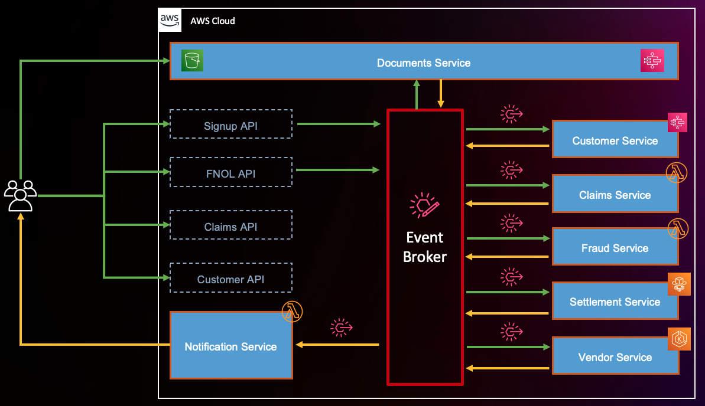
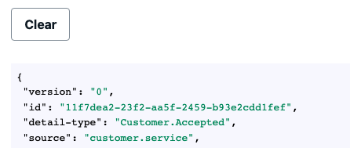

# Insurance Claims Processing using Serverless and Event-Driven Architecture

## Introduction

This code repository contains a sample application for Insurance Claims Processing using Serverless and Event Driven Architecture as described in [this blog](https://aws.amazon.com/blogs/industries/building-a-modern-event-driven-application-for-insurance-claims-processing-part-2/).

## Blogs
- [Building a modern, event-driven application for insurance claims processing – Part 1](https://aws.amazon.com/blogs/industries/building-a-modern-event-driven-application-for-insurance-claims-processing-part-1/)
- [Building a modern, event-driven application for insurance claims processing – Part 2](https://aws.amazon.com/blogs/industries/building-a-modern-event-driven-application-for-insurance-claims-processing-part-2/)
- [Extending a serverless, event-driven architecture to existing container workloads](https://aws.amazon.com/blogs/compute/extending-a-serverless-event-driven-architecture-to-existing-container-workloads/)

## Structure

This sample application comprises:

- Frontend — using AWS AppSync and ReactJS
- Backend — using AWS Serverless Cloud Native services with AWS CDK as IaC

The backend infrastructure is set up at the root folder of the repository. Code for frontend is under `/react-claims` directory.

## Technology Stack

### Current Versions
- **Node.js**: 22.x (all Lambda functions)
- **AWS CDK**: 2.235.1
- **AWS SDK v3**: 3.900.0
- **React**: 18.3.1
- **AWS Amplify**: 5.3.20 (frontend)
- **Spring Boot**: 3.3.13 (Settlement Service)
- **EKS**: Kubernetes 1.34 with AL2023 AMI (Vendor Service)
- **KEDA**: 2.16.1 (EKS autoscaling)

### Container Services
- **Settlement Service**: Spring Boot application on ECS Fargate (x86_64)
- **Vendor Service**: Node.js Express application on EKS Spot cluster (x86_64)

### Voice AI Services
- **Amazon Bedrock AgentCore Runtime**: Serverless voice agent deployment
- **Amazon Nova 2 Sonic**: Speech-to-speech foundation model (amazon.nova-2-sonic-v1:0)
- **Strands Agents SDK**: Conversational AI framework
- **FastAPI**: WebSocket server for real-time audio streaming
- **Python**: 3.13 (voice agent runtime)

### Recent Upgrades (January 2026)

**Critical Updates:**
- Node.js upgraded from 18.x to 22.x across all 15 Lambda functions (Node 18 EOL April 2025)
- EKS upgraded from Kubernetes 1.27 to 1.34 with AL2023 AMI (1.27 EOL July 2025)
- AWS SDK v3 updated to 3.900.0 for latest security patches
- Migrated from deprecated CDK alpha packages to stable releases

**Infrastructure Fixes:**
- Fixed Lambda log retention deprecation by migrating from `logRetention` to `logGroup` pattern across all functions
- Resolved Docker platform architecture issues by adding explicit x86_64 platform specifications for Settlement (ECS) and Vendor (EKS) services
- Fixed CDK deployment warnings including Custom Resources SDK installation and ECS deployment configuration
- Added zero-downtime deployment configuration for Settlement service (minHealthyPercent: 100, maxHealthyPercent: 200)

**Frontend Updates:**
- React upgraded to 18.3.1 with updated testing libraries
- AWS Amplify remains on v5.3.20 (stable) - v6 migration evaluated and deferred due to high refactoring risk for real-time PubSub/IoT functionality

**Backend Services:**
- Spring Boot upgraded to 3.3.13 with AWS SDK BOM 2.30.29 and Spring Cloud AWS 3.2.1
- KEDA upgraded to 2.16.1 for EKS autoscaling

## Overall Architecture



Different services in backend architecture interact with Amazon EventBridge custom event Bus. The event rules can invoke more than one target for any event. For example, when a customer is submitted successfully, notification service is invoked to notify a front end and a step function is invoked to process the customer and create urls to upload license and vehicle images.

This overall architecture consists of below domains. Visit each one of them for underlying details:

- [Customer](lib/services/customer/README.md)
- [Claims](lib/services/claims/README.md)
- [Documents](lib/services/documents/README.md)
- [Fraud](lib/services/fraud/README.md)
- [Settlement](lib/services/settlement/README.md)
- [Notifications](lib/services/notifications/README.md)

## Setup

### Prerequisites

- Install [NodeJS v22](https://nodejs.org/en/download/) (Node.js 18 reached EOL in April 2025)
- [Set up AWS CDK](https://docs.aws.amazon.com/cdk/latest/guide/getting_started.html)
- [Set up AWS CLI](https://docs.aws.amazon.com/cli/latest/userguide/getting-started-install.html)
- [Configure AWS CLI](https://docs.aws.amazon.com/cli/latest/userguide/cli-configure-quickstart.html)
- [Install Amplify CLI](https://docs.amplify.aws/cli/start/install/)
- Download and install [Docker Desktop](https://www.docker.com/products/docker-desktop/)

> :information_source: **M1/M2/M3 Mac Users**
> The application now includes explicit Docker platform specifications for x86_64 architecture. Docker will automatically build images for the correct platform regardless of your host architecture. Ensure Docker Desktop is running before deployment.

### Deploy CDK stack (Backend)

> :warning: Make sure the docker engine is running.

* Clone the repository
* From project root, run the following commands

  `npm install`


* Followed by:

  `npm run deploy`

Wait until the stack is deployed.

### Deploy Amplify App (Frontend)

> :information_source: **AWS Amplify Version**
> This application uses AWS Amplify v5.3.20 (stable). Migration to v6 evaluated and deferred - would require refactoring 5 components with 150+ lines of code changes and poses risk to mission-critical real-time PubSub/IoT functionality.

In order to deploy the frontend:

`cd react-claims`

then run the following commands:

```bash
npm install
npm run amplify init
```

Provide the following values when prompted -

> Enter a name for the environment <environment name, like dev, sandbox> **claimsdev**  
> Choose your default editor: Visual Studio Code  
> Select the authentication method you want to use: **AWS profile**  
> Please choose the profile you want to use: **default**

Next run this command:

```bash
npm run amplify push
```

> Are you sure you want to continue? **Yes**

After `amplify push` is complete, in the output, there should be a URL for the hosted frontend.

If you need to retrieve this URL in the future, run `amplify status` and the output of that command would have `Amplify hosting urls:` section with the URL to the frontend.
The url will be of this format:
`https://<env_name>.<autogenerated_amplify_app_id>.amplifyapp.com`

> Note: It might take a few minutes for the published app to work.

Run `npm run amplify publish` to deploy front end application. After this command completes, use the url it returns to access the application.

To work on the frontend locally, run `npm run start` from <root>/react-claims directory. This will host the frontend app locally at http://localhost:3000/

To publish front end changes in the future, call `npm run amplify publish` from <root>/react-claims directory.

## How to use the application

Now that you have the backend and frontend deployed, let's walk through on how to use the sample application:

### Customer On-boarding (Sign up)

Go to front end url (if published) or if you are running the front end in local, access it at http://localhost:3000/

On the first page, click on `Create Account`


Fill in details and click on `Create Account` button.


> Make sure to provide a valid email address to receive an OTP

Verify email by entering code received on your email id and click on `Confirm` button.


On the next screen, provide following values -

- First Name: Connor
- Last Name: Sample
- Email: Should auto-populate
- SSN: 000000000
- Street: 124 Main St
- City: Phoenix
- State: AZ
- Zip: 85007
- Make: Honda
- Model: Accord
- Color: Green
- Type: Sedan
- Year: 2001
- Mileage: 200000
- VIN: 1HGCF86461A130849


Click on `Submit`. This will initiate a request to create a policy record.

As an async response, you will see the event payload that the backend has sent back to the client via Notifications Service. It should look something like:

```json
{
  "version": "0",
  "id": "149f4a08-68eb-fb3c-e1f0-bc2d9d4cfd7e",
  "detail-type": "Customer.Accepted",
  "source": "customer.service",
  "account": "123456789",
  "time": "2023-01-09T22:48:05Z",
  "region": "us-east-2",
  "resources": [
    "arn:aws:states:us-east-2:123456789:stateMachine:createcustomerF825405F",
    "arn:aws:states:us-east-2:123456789:express:createcustomerF825405F-O62M4TWvT56k:2eed79c1-a79e-c8ec-4370-8ff898354fac_9320ae7a-1b66-9e42-fef8-3b3ffce238d5:f6b27e90-be58-4b18-8772"
  ],
  "detail": {
    "driversLicenseImageUrl": "<pre-signed s3 url>",
    "carImageUrl": "<pre-signed s3 url>",
    "customerId": "43fed912-e5af-4c6a-a251-4f3c8195153e"
  }
}
```

The frontend app uses the `customerId` from this event payload to use in subsequent api calls.

### Document Processing

After this request is complete, you'll see options to upload the license and car image.

Select first license image and click on `Upload`.


You should see `Document.Processed` event payload on right half of the page:

```json
{
  "version": "0",
  "id": "7b2c4153-be46-46e4-49f1-1b489d448166",
  "detail-type": "Document.Processed",
  "source": "document.service",
  "account": "123456789",
  "time": "2023-01-09T22:49:30Z",
  "region": "us-east-2",
  "resources": [
    "arn:aws:states:us-east-2:123456789:stateMachine:DocumentServiceDocumentProcessingStateMachine270B2952",
    "arn:aws:states:us-east-2:123456789:express:DocumentServiceDocumentProcessingStateMachine270B2952-9DUVrsTroDxS:e51807e2-dd06-a5cb-1f6b-8bb8fc08aac0_52e24321-eebf-0a93-11c8-4a0120757e6c:364e3437-42e8-4594-8fc5"
  ],
  "detail": {
    "documentType": "DRIVERS_LICENSE",
    "analyzedFieldAndValues": {
      "FIRST_NAME": "JELANI",
      "MIDDLE_NAME": "",
      "SUFFIX": "",
      "CITY_IN_ADDRESS": "PHOENIX",
      "ZIP_CODE_IN_ADDRESS": "85007",
      "STATE_IN_ADDRESS": "AZ",
      "STATE_NAME": "ARIZONA",
      "DOCUMENT_NUMBER": "D08954142",
      "EXPIRATION_DATE": "01/01/2039",
      "DATE_OF_BIRTH": "01/01/1974",
      "DATE_OF_ISSUE": "03/01/2016",
      "ID_TYPE": "DRIVER LICENSE FRONT",
      "ENDORSEMENTS": "NONE",
      "VETERAN": "VETERAN",
      "RESTRICTIONS": "NONE",
      "CLASS": "D",
      "ADDRESS": "123 MAIN ST",
      "COUNTY": "",
      "PLACE_OF_BIRTH": "",
      "MRZ_CODE": ""
    },
    "customerId": "43fed912-e5af-4c6a-a251-4f3c8195153e"
  }
}
```

Above event has the extracted attributes from the driver's license image that you uploaded. The Document Service uses Amazon Textract to extract structured information from driver's license documents. For vehicle images, the service uses Amazon Nova 2 Lite multimodal model to analyze car color and detect damage.

However, you will see another event right after above event detecting fraud.

### Fraud Processing

If you notice closely,
that you have provided in the form earlier (Connor)
does not match with the first name that was extracted from the uploaded driver's license,
therefore, a document fraud was detected.
This resulted in a `fraud.detected` event as below:

```json
{
  "version": "0",
  "id": "1869d1ac-e9f3-300b-a6d8-fa460a7c5d5e",
  "detail-type": "Fraud.Detected",
  "source": "fraud.service",
  "account": "123456789",
  "time": "2023-01-09T22:49:32Z",
  "region": "us-east-2",
  "resources": [],
  "detail": {
    "customerId": "43fed912-e5af-4c6a-a251-4f3c8195153e",
    "documentType": "DRIVERS_LICENSE",
    "fraudType": "DOCUMENT",
    "fraudReason": "First Name provided does not match with First Name in Driver's License"
  }
}
```

In order to fix the above discrepancy, choose the second DL and upload. Now you should not see any more event related to fraud.

Fraud detection is possible because the Document Processing Service has analyzed the car image using Amazon Nova 2 Lite multimodal model to determine the color of the vehicle. The document processed event is sent back to client too. It looks like:

```json
{
  "version": "0",
  "id": "805ab258-529b-7c19-9bfd-4249221ef129",
  "detail-type": "Document.Processed",
  "source": "document.service",
  "account": "123456789",
  "time": "2023-01-09T23:43:22Z",
  "region": "us-east-2",
  "resources": [
    "arn:aws:states:us-east-2:123456789:stateMachine:DocumentServiceDocumentProcessingStateMachine270B2952",
    "arn:aws:states:us-east-2:123456789:express:DocumentServiceDocumentProcessingStateMachine270B2952-9DUVrsTroDxS:3420c185-4244-c879-ba6d-77ecb983950f_1dc32129-ddf7-56f9-8375-7233087997d7:afc2e8e9-4947-4e6d-8bb9"
  ],
  "detail": {
    "documentType": "CAR",
    "recordId": "0dd81c79-7214-4956-808d-33600692a25a",
    "analyzedFieldAndValues": {
      "damage": {
        "Name": "unknown",
        "Confidence": 99.98300170898438
      },
      "color": {
        "Name": "green",
        "Confidence": 99.98400115966797
      },
      "type": "signup"
    },
    "customerId": "43fed912-e5af-4c6a-a251-4f3c8195153e"
  }
}
```

### File a Claim (First Notice of Loss or FNOL)

Now that the customer has been on-boarded, we need to replicate a scenario of an incident/accident where customer met an accident and is about to file a claim.

Click on `File a new claim` and scroll down to the new claim form.


Fill in all the fields. Please note that the event date should be in future from today after the policy creation date. So if you are testing this step right after registration, select the next day for the occurrence date.


Make sure the driversLicenseNumber matches with the actual DL number that has been extracted from the DL document image. Otherwise, claim will be rejected based on personal information mismatch:

```json
{
  "version": "0",
  "id": "56796bef-a8c4-6328-2d3c-4bf7a5c7d1aa",
  "detail-type": "Claim.Rejected",
  "source": "claims.service",
  "account": "123456789",
  "time": "2023-01-09T23:50:25Z",
  "region": "us-east-2",
  "resources": [],
  "detail": {
    "customerId": "43fed912-e5af-4c6a-a251-4f3c8195153e",
    "message": "Personal information (Driver's License) does not match"
  }
}
```

Scroll down and copy the `DOCUMENT_NUMBER` value from the event payload of the DL extracted data of the correct driver. Paste the DL number in the claims form.

Next, click on `Submit Claim`

Once claim has been accepted successfully, you should see below event:

```json
{
  "version": "0",
  "id": "09753505-7de8-d418-8cc0-f18d8ccfc04b",
  "detail-type": "Claim.Accepted",
  "source": "claims.service",
  "account": "123456789",
  "time": "2023-01-09T23:52:57Z",
  "region": "us-east-2",
  "resources": [],
  "detail": {
    "customerId": "43fed912-e5af-4c6a-a251-4f3c8195153e",
    "claimId": "7a851dbe-03b1-4c25-a4f3-4ac968d484a5",
    "uploadCarDamageUrl": "<pre-signed S3 url>",
    "message": "Claim Information has been accepted"
  }
}
```

Now you can see `claimsId` in addition to `customerId`.

There should be an option to upload car image with damage.


At this point if you document processing returns red color, then you will again see a fraud detection event as your policy has registered a green car:

```json
{
  "version": "0",
  "id": "74c29a57-724a-e645-2fea-0989da0548fc",
  "detail-type": "Fraud.Detected",
  "source": "fraud.service",
  "account": "123456789",
  "time": "2023-01-09T23:55:18Z",
  "region": "us-east-2",
  "resources": [],
  "detail": {
    "customerId": "43fed912-e5af-4c6a-a251-4f3c8195153e",
    "documentType": "CAR",
    "fraudType": "CLAIMS",
    "fraudReason": "Color of vehicle doesn't match the color on the policy."
  }
}
```

### File a Claim Using Voice Agent (Alternative Method)

Instead of filling out the claim form manually, you can use the voice-enabled AI agent for a more natural, conversational experience:

1. On the claim submission page, click the "Start Voice Claim" button
2. Allow microphone access when prompted by your browser
3. The agent will first retrieve your customer information automatically from the system
4. Speak naturally to describe your accident - the agent will ask follow-up questions as needed
5. The agent will collect incident details: date/time, location, damage description, and other required information
6. Review the collected information displayed as JSON on the screen (updates in real-time as you speak)
7. Confirm submission when the agent asks for your approval
8. The agent will say: "Your claim has been submitted and a decision will be taken soon"
9. Wait for processing (typically 1-3 seconds) - you'll see a spinner with "Processing Your Claim..."
10. When the claim is accepted, the voice session automatically ends after a brief delay
11. You'll automatically advance to the next step (Upload Damaged Car Image)

**Benefits of Voice Agent**:
- Natural conversation instead of form filling
- Automatically retrieves your policy and driver's license information
- No need to remember or look up details you've already provided
- Real-time validation and feedback during the conversation
- Faster submission for users who prefer speaking over typing

**Note**: If you prefer the traditional form-based approach or encounter any issues with the voice agent, you can always use the manual claim form instead.

## Voice AI Agent for FNOL Claims

The application includes a voice-enabled First Notice of Loss (FNOL) agent that allows customers to submit insurance claims through natural voice conversation using Amazon Bedrock AgentCore Runtime and Amazon Nova 2 Sonic.

### Architecture

[View Detailed Architecture Diagram](lib/services/voice-fnol-agent/architecture.md) - Comprehensive ASCII diagram showing complete event flow

### Key Features

- **Speech-to-Speech Conversation**: Natural voice interaction powered by Amazon Nova 2 Sonic model
- **Real-time Audio Streaming**: Bidirectional audio streaming with barge-in support for interruptions
- **Customer Data Retrieval**: Automatically retrieves customer, policy, and driver's license information to eliminate redundant questions
- **Event-Driven Integration**: Seamlessly integrates with the existing event-driven architecture via EventBridge and IoT Core
- **Automatic Progression**: Advances user to next step automatically when claim is accepted
- **Session Management**: Automatically ends voice session upon claim acceptance
- **Real-time Updates**: Displays collected claim data as JSON that updates during conversation
- **Security**: AWS SigV4 authentication, IAM policies, and per-user MQTT topics

### Agent Tools

The voice agent uses 6 specialized tools:
- **get_customer_info**: Retrieves customer, policy, and driver's license data from Customer API
- **submit_to_fnol_api**: Submits complete claim to FNOL API with AWS SigV4 authentication
- **safety_check**: Assesses user safety before proceeding with claim collection
- **extract_claim_info**: Extracts structured data from natural conversation
- **validate_fields**: Validates required fields are present before submission
- **Other utility tools**: For conversation management and validation

### Technology Stack

- **Amazon Bedrock AgentCore Runtime**: Serverless deployment and scaling for voice agent
- **Amazon Nova 2 Sonic**: State-of-the-art speech-to-speech foundation model
- **Strands Agents SDK**: Framework for building conversational AI agents
- **AWS IoT Core**: Real-time MQTT messaging for claim status updates
- **Amazon EventBridge**: Event routing and orchestration
- **Docker**: Containerized agent deployment (ARM64 architecture)

### How It Works

1. **User Initiates**: Customer clicks "Start Voice Claim" button in React frontend
2. **WebSocket Connection**: Establishes secure WebSocket connection with SigV4 authentication
3. **Customer Data Retrieval**: Agent calls Customer API to retrieve existing customer, policy, and driver's license information
4. **Voice Conversation**: Agent conducts natural voice conversation, asking only incident-specific questions (location, description, etc.)
5. **Claim Submission**: Agent submits complete claim to FNOL API with AWS SigV4 authentication
6. **Async Processing**: Backend validates claim asynchronously (1-3 seconds) via EventBridge → SQS → Claims Processing Lambda
7. **Real-time Notification**: IoT Core delivers `Claim.Accepted` or `Claim.Rejected` event to frontend via MQTT
8. **Auto-Advancement**: On acceptance, voice session ends automatically and user advances to next step (Upload Damaged Car)

### User Experience

- **Compact UI**: Streamlined interface that fits without scrolling
- **Real-time Feedback**: Displays transcription and collected claim data as JSON during conversation
- **Processing State**: Shows spinner with "Processing Your Claim..." message while backend validates
- **Timeout Handling**: 30-second timeout with helpful error message if processing takes too long
- **Graceful Errors**: Clear error messages for network issues, rejections, or permission problems

### Documentation

- [Event Flow Analysis](lib/services/voice-fnol-agent/EVENT_FLOW_ANALYSIS.md) - Detailed event flow and integration patterns
- [Integration Summary](lib/services/voice-fnol-agent/INTEGRATION_SUMMARY.md) - Implementation details and changes
- [Voice FNOL Service](lib/services/voice-fnol-agent/README.md) - Service-specific documentation

### Benefits

- **Improved Accessibility**: Voice interface for customers who prefer speaking over typing
- **Faster Submission**: Natural conversation is often faster than form filling
- **Reduced Errors**: Agent validates data in real-time during conversation
- **Better Experience**: Conversational interface feels more natural and supportive
- **Seamless Integration**: Reuses existing event-driven architecture without duplication

### Settlement
As soon as the correct image of the damage car is uploaded and processed, you should see a `Settlement.Finalized` event coming back from the Settlement service.
Settlement service is built using Spring Boot application running on ECS Fargate. This shows that event-driven applications can be integrated with container workloads seamlessly.

The event payload would look like:

```json
{
 "version": "0",
 "id": "e2a9c866-cb5b-728c-ce18-3b17477fa5ff",
 "detail-type": "Settlement.Finalized",
 "source": "settlement.service",
 "account": "123456789",
 "time": "2023-04-09T23:20:44Z",
 "region": "us-east-2",
 "resources": [],
 "detail": {
  "settlementId": "377d788b-9922-402a-a56c-c8460e34e36d",
  "customerId": "67cac76c-40b1-4d63-a8b5-ad20f6e2e6b9",
  "claimId": "b1192ba0-de7e-450f-ac13-991613c48041",
  "settlementMessage": "Based on our analysis on the damage of your car per claim id b1192ba0-de7e-450f-ac13-991613c48041, your out-of-pocket expense will be $100.00."
 }
}
```

### Vendor
Vendor domain subscribes to `Settlement.Finalized` event. When a settlement is finalized, the vendor domain figures out a temporary rental car for the insurer. Ideally, the vendor domain/service would call 3rd party car rental service APIs to get quote on the rental cost. Based on its business logic, it decides which rental car option will be optimal for the insurer.
Vendor service is built using a NodeJS Express application running on an EKS Spot cluster. EKS pods scale up and down based on an SQS queue depth using [KEDA](https://keda.sh/docs/2.11/scalers/aws-sqs/) scaler. This shows that event-driven applications can be integrated with container workloads seamlessly that can run on EKS too.

The event payload from vendor service would look as below once a rental car company has been finalized:

```json
{
 "version": "0",
 "id": "8ec4555c-e726-9518-eaf8-7f3bdabfcf72",
 "detail-type": "Vendor.Finalized",
 "source": "vendor.service",
 "account": "1234567890",
 "time": "2023-09-06T16:04:14Z",
 "region": "us-east-2",
 "resources": [],
 "detail": {
  "customerId": "08bee3df-0e2a-4873-8c91-46e55d2460a6",
  "vendorMessage": "Multiple car rental vendors were contacted for claim with id b33af013-763c-4da7-94ba-37cdaace999e. Enterprise Rental car has been finalized for you to temporarily use until your car is repaired."
 }
}
```

### Clear Events

To clear events on the web page, click on `Clear` button above the list of events. This will only clear the area on the web page where events log is displayed.



### Clear Data

To delete all the data for current logged-in user, you can use `CLEAR ALL DATA` button. Clicking on this button will clear data for the current logged-in user in S3 bucket and DynamoDB tables.


## Observability

There is an EventBridge rule - `allEventLogsRule` which invokes its targets for all the key events sent to Event Bus. The rule has two targets:

- A CloudWatch log group to capture all events in CloudWatch.
- A Lambda Function `CreateMetricsFunction` which creates a CloudWatch metric to indicate occurrence of the individual events.

Here's the wild card rule for almost all event types taken from `claims-processing-stack.ts`:

```javascript
new Rule(this, "AllEventLogsRule", {
  eventBus: bus,
  ruleName: "allEventLogsRule",
  eventPattern: {
    source: [
      "signup.service",
      "customer.service",
      "fnol.service",
      "claims.service",
      "document.service",
      "fraud.service",
      "aws.s3",
    ],
  },
  targets: [
    new CloudWatchLogGroup(allEventsLogGroup),
    new LambdaFunction(createMetricsLambdaFunction),
  ],
});
```

These metrics are used to create a CloudWatch dashboard to present business KPIs and metrics for Lambda function, API Gateway APIs, event rules, and state machines.

In AWS Console, navigate to CloudWatch > Dashboards > Claims-Processing-Dashboard to review this dashboard.

## Events Catalog
Event driven architectures like this Insurance claims processing application use events as the first class citizen. Similar to APIs, that uses schemas or specifications like OpenAPI spec for contract based communications, EDA we will also need a mechanism to define a schema and showcase which entities are event producers and consumers. This will provide a better visibility around the events that flow in and out of systems. Event Catalog provides that for this applications. For guidance on generating the event catalog and deploying it as web application using Amplify, please follow this [link](https://github.com/aws-samples/serverless-eda-insurance-claims-processing/tree/main/event-catalog) for detailed instructions.

## Troubleshooting

### Common Issues

**Docker Platform Errors**
- Ensure Docker Desktop is running before deployment
- Application automatically builds images for x86_64 architecture regardless of host platform
- Both Settlement (ECS) and Vendor (EKS) services include explicit platform specifications

**CDK Deployment Warnings**
- Custom Resources SDK installation warnings resolved via context flag in cdk.json
- ECS deployment configuration updated with minHealthyPercent: 100 for zero-downtime deployments
- SQS encryption warnings are informational only (using KMS encryption)

**ECS Cluster Inactive Error**
- Occurs when ECS cluster is deleted but CloudFormation still references it
- Solution: Delete and recreate stack, or implement shared VPC architecture to avoid resource conflicts

**React App Compilation Errors**
- Application uses AWS Amplify v5.3.20 (stable)
- If encountering import errors, verify package.json has correct Amplify versions
- Run `npm install` in react-claims directory to ensure dependencies are correct

**Internet Gateway Quota Exceeded**
- AWS accounts have default limit of 5 IGWs per region
- Consider implementing shared VPC architecture across multiple stacks
- Request quota increase via AWS Service Quotas console if needed

**EKS AMI Compatibility**
- Kubernetes 1.33+ requires Amazon Linux 2023 (AL2023)
- Amazon Linux 2 (AL2) only supported up to Kubernetes 1.32
- Vendor service configured with AL2023_X86_64_STANDARD AMI type

## Cleanup

In order to clean up the infrastructure follow below sections:

### Delete Amplify resources.

cd to `/react-claims` run following commands

`amplify delete`

```
Are you sure you want to continue? This CANNOT be undone. (This will delete all the environments of the project from the cloud and wipe out all the local files created by Amplify CLI) (y/N) Y
```

After the process completes, you should see following message -

```
✔ Project deleted in the cloud.
Project deleted locally.
```

> :fire: `amplify delete` also deletes the project from local. This will result in deletion of some of the files that are present in the repository. Do not commit the deletion as you will need these files if you want to deploy the frontend application again.

### Delete principals attached to IOTPOLICY

- Login to AWS Console and go to AWS IoT Core --> Security --> Policies and select the policy that starts with your stack name and ends with IOT_POLICY
- Click on `Targets`
- Select all the principals listed there and click on `Detach`.
- Click `Detach` again on next page to confirm.

### Delete CDK Stack

> :warning: Make sure docker engine is running

cd to root directory

run `npm run cdk destroy`

## Conclusion

In this example we deployed and tested an event based claims processing system. We used CDK to deploy the backend infrastructure and AWS Amplify for frontend. In the frontend application we reviewed the events that were transmitted by different services to EventBridge to understand how system is processing the data. At the end, we cleaned up by deleting all the resources deployed as part of this activity.

## Security

See [CONTRIBUTING](CONTRIBUTING.md#security-issue-notifications) for more information.

## License

This library is licensed under the MIT-0 License. See the LICENSE file.
