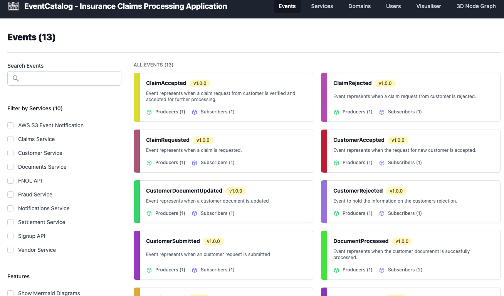

# Event Catalog - Insurance Claims Processing Application

This section contains the EventCatalog for the Insurance Claims Processing Application. It documents all events, services, and domains in the event-driven architecture, providing visual exploration of how services connect through EventBridge.

EventCatalog lets you:
- Document events, schemas, and service relationships
- Visualize producer/consumer connections between services
- Track event ownership across teams and domains
- Browse and search your event-driven architecture

## Prerequisites

- Node.js 18+
- npm

## Getting Started

From the repository root:

```bash
cd event-catalog
npm install
```

## Development Mode

Run the local dev server to see live updates as you edit:

```bash
npm run dev
```

Your catalog will be available at **http://localhost:3000**. The dev server hot-reloads as you make changes — no rebuild needed.

## Build

To produce a deploy-ready static site:

```bash
npm run build
```

The output is written to the `dist/` directory. To preview the built site locally before deploying:

```bash
npm run preview
```

> Note: `npm run preview` serves the last build. Any edits made after building won't appear until you run `npm run build` again.

## Deployment

EventCatalog builds to static HTML by default, so you can host it anywhere — S3, Amplify, Netlify, Vercel, etc.

Refer to the [EventCatalog hosting docs](https://www.eventcatalog.dev/docs/development/deployment/hosting-options) for all options.

### Deploy to AWS Amplify (manual)

1. Build the catalog: `npm run build`
2. Zip the output: `cd dist && zip -r ../event-catalog.zip .`
3. In the AWS Amplify console, choose **Manual deploy** and upload `event-catalog.zip`
4. See [Amplify manual deploy docs](https://docs.aws.amazon.com/amplify/latest/userguide/manual-deploys.html) for detailed steps

## Updating the Catalog

All content files use `.mdx` format and require `id` and `version` in their frontmatter.

### Adding a new Event

Create a folder under `/events` with an `index.mdx` and optionally a `schema.json`:

```
/events/{EventName}/index.mdx
/events/{EventName}/schema.json
```

Minimal `index.mdx`:

```mdx
---
id: MyEvent
name: MyEvent
version: 1.0.0
summary: |
  Brief description of the event.
producers:
    - My Service
consumers:
    - Other Service
owners:
    - your-alias
---

### Details

Description of when and why this event is emitted.

<NodeGraph />
<Schema />
```

### Adding a new Service

```
/services/{ServiceName}/index.mdx
```

```mdx
---
id: MyService
name: My Service
version: 1.0.0
summary: |
  What this service does.
owners:
    - your-alias
---
```

### Adding a new Domain

```
/domains/{DomainName}/index.mdx
```

```mdx
---
id: MyDomain
name: My Domain
version: 1.0.0
summary: |
  What this domain covers.
owners:
    - your-alias
---
```

For full configuration options see the [EventCatalog docs](https://www.eventcatalog.dev/docs).


