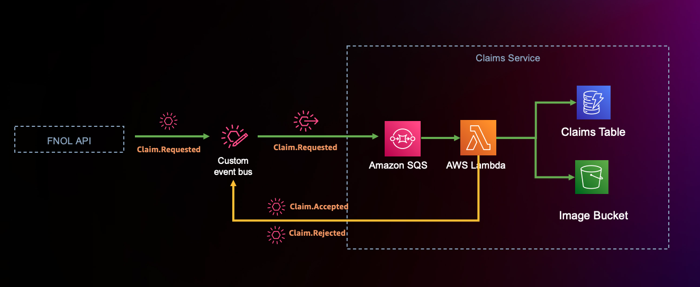

## Claims Domain

### Architecture

1. The customer submits the details of the incident (date of incident, number of parties involved, location of incident, etc.) through the frontend application. 
2. This claim submission invokes the FNOL API, which emits a Claim.Requested event. 
3. To allow the claims service to handle a sudden spike in traffic, such as processing home insurance claims during extreme weather events or natural catastrophes including floods, hurricanes, earthquakes, or tornadoes, calls from the FNOL API are sent to an Amazon SQS queue. The queue acts as an event store, allowing the service to buffer events and not overwhelm any downstream services. 
4. A claims processing Lambda function polls from the queue and begins work on the claim request. The claims processing Lambda function verifies FNOL information from the payload and, upon successful validation, persists the information in the Claims DynamoDB table. Then, it creates an Amazon S3 pre-signed URL in order for the customer to upload images of the damaged car. 
5. The Lambda function emits a Claim.Accepted or Claim.Rejected event back to the custom event bus based on success or failure.