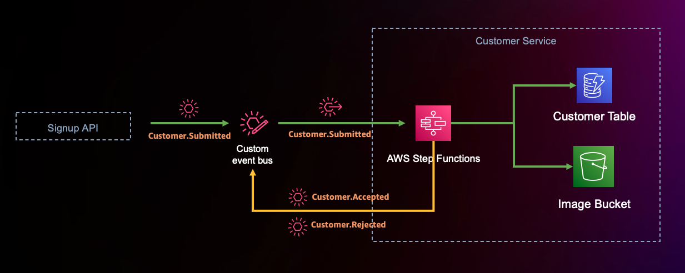

## Customer Domain

### Architecture

1. The Signup API emits a Customer.Submitted event to the EventBridge custom event bus. 
2. We set up an EventBridge rule to route event payloads of the type Customer.Submitted to the Customer service domain. 
3. Upon successful rule evaluation, EventBridge asynchronously invokes a Step Functions state machine in the Customer service domain. 
4. The state machine orchestrates the signup process and emits Customer.Accepted or Customer.Rejected events back to the event broker based on the success or failure scenario.