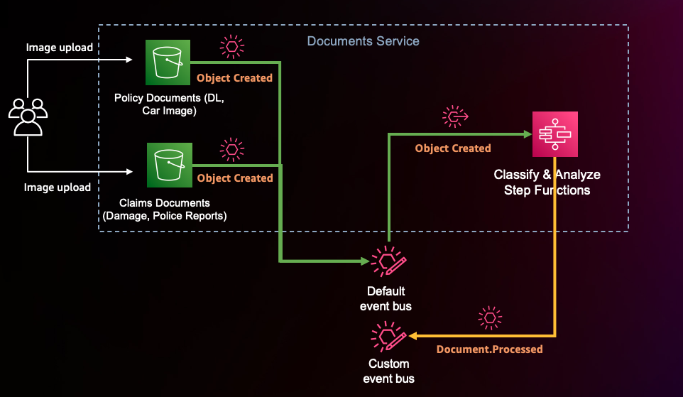

## Documents Domain

### Architecture

1. The customer uses the pre-signed URLs provided during the signup process to upload those two images. 
2. Once the images are uploaded to the policy documents S3 bucket, Amazon S3 triggers an Object Created event to the default EventBridge event bus. 
3. An EventBridge rule matches the Object Created event type and invokes the document processing Step Functions workflow that is used to classify and analyze the image in the S3 bucket. 
4. Once the document processing is complete, the Step Functions workflow emits a Document.Processed event to the custom event bus with data from the analysis added to the event payload.