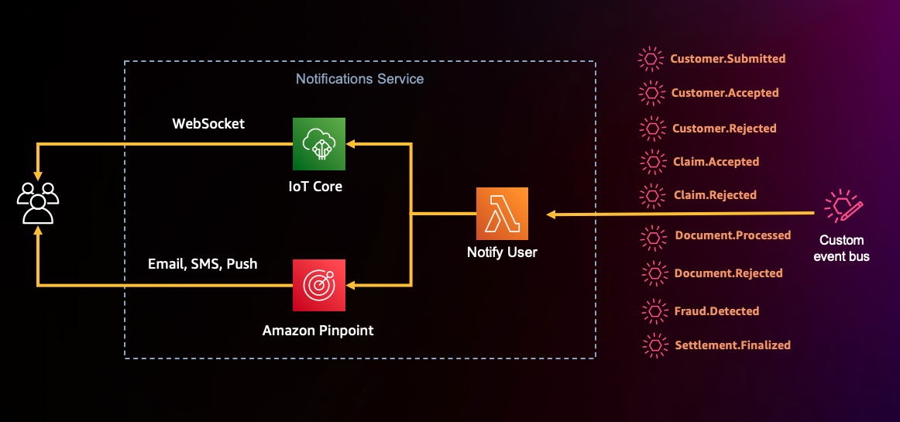

## Notifications Domain

### Architecture

The notifications service sends notifications from the claims processing application to the customer. 
A notification Lambda function subscribes to all the event types that help the customer stay informed about their account and claims statuses. 
The notification Lambda function uses AWS IoT Core to notify the event to the user via a web socket. 
Besides web sockets, the notifications service can also use services like Amazon Pinpoint to send email, SMS, or push notifications to the customer when an event occurs.